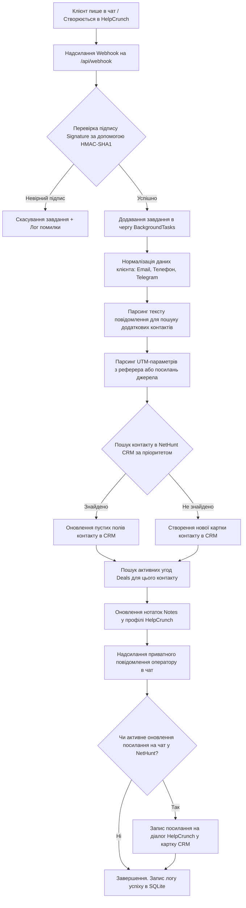

# Інтеграційний міст NetHunt - HelpCrunch Bridge: Рефакторинг та Логіка роботи

Цей документ містить детальний опис технічної логіки роботи інтеграційного сервісу та покроковий план рефакторингу для виправлення виявлених помилок і підвищення стабільності.

---

## 🛠️ План рефакторингу та виправлення помилок

Під час аналізу кодової бази та логів бази даних було виявлено критичні вразливості та баги, які потребують виправлення.

### 1. Виправлення багу створення контакту NetHunt (Синхронізація ID)
* **Проблема:** Під час створення нового контакту за допомогою методу `create_contact` у файлі [nethunt.py](file:///c:/Users/bhsma/Projects/nethunt-helpcrunch-bridge/backend/services/nethunt.py) NetHunt API повертає словник, де ідентифікатор запису зберігається в полі `"recordId"`. Проте основний код у [main.py](file:///c:/Users/bhsma/Projects/nethunt-helpcrunch-bridge/backend/main.py) намагається отримати його через `.get("id")`. Через це згенерований ID стає `None`, що призводить до:
  * Помилок у пошуку пов'язаних угод (Deals).
  * Неправильного формування посилань на картки контактів у нотатках HelpCrunch.
  * Неможливості записати посилання на чат HelpCrunch назад у NetHunt CRM.
* **Рішення:** Модифікувати функцію `create_contact` в [nethunt.py](file:///c:/Users/bhsma/Projects/nethunt-helpcrunch-bridge/backend/services/nethunt.py), щоб вона автоматично копіювала значення з `"recordId"` у `"id"` для консистентності з іншими методами пошуку. Додатково у [main.py](file:///c:/Users/bhsma/Projects/nethunt-helpcrunch-bridge/backend/main.py) зробити безпечне зчитування імені контакту через `contact.get("name") or contact.get("fields", {}).get("Name")`.

### 2. Забезпечення стійкості сесій користувачів (Persistent Session Secret)
* **Проблема:** Зараз змінна `SESSION_SECRET` у [auth.py](file:///c:/Users/bhsma/Projects/nethunt-helpcrunch-bridge/backend/auth.py) генерується випадковим чином у пам'яті під час кожного старту додатка (`os.urandom(32)`). Це призводить до того, що під час будь-якого перезапуску Docker-контейнера чи автоматичного перезапуску сервера (reload) всі активні сесії адміністраторів анулюються, і користувачі змушені авторизуватися наново (разом із введенням TOTP 2FA коду).
* **Рішення:** Зберігати `SESSION_SECRET` у окремій таблиці бази даних SQLite (`session_keys`). Під час старту сервіс намагатиметься прочитати секрет із бази даних, а якщо його немає — згенерує, збереже в базу і використовуватиме надалі. Це збереже сесії користувачів активними.

### 3. Надійне логування помилок у фонових завданнях (Robust Error Handling)
* **Проблема:** Метод `process_sync_task` у [main.py](file:///c:/Users/bhsma/Projects/nethunt-helpcrunch-bridge/backend/main.py) запускається асинхронно через FastAPI `BackgroundTasks`. У разі виникнення мережевих винятків (таймаути API, збої зв'язку) або помилок парсингу, виняток перериває виконання завдання, проте статус помилки не записується у базу даних SQLite, через що користувач бачить пустий статус на панелі моніторингу замість детального опису проблеми.
* **Рішення:** Обернути все тіло функції `process_sync_task` у блок `try...except Exception`, який у разі виникнення будь-якої помилки записуватиме деталізований трейсбек помилки в SQLite з прапорцем `status="error"`, щоб оператор міг легко діагностувати проблему через панель керування.

---

## ⚙️ Логіка роботи сервісу (NetHunt - HelpCrunch Bridge)

Міст забезпечує автоматичний обмін даними між HelpCrunch (чат-платформа) та NetHunt (CRM-система).

### Покроковий життєвий цикл обробки подій

### Детальний опис етапів роботи:

#### 1. Отримання та верифікація вебхуку
* HelpCrunch надсилає JSON-трансляцію подій на endpoint `/api/webhook`.
* Якщо задано секретний ключ вебхуку (`helpcrunch_webhook_secret`), сервіс розраховує SHA1 хеш на основі отриманого тіла (raw body) та порівнює його з заголовком `X-HelpCrunch-Signature`. У разі неспівпадіння запит відхиляється з кодом `401 Unauthorized`.
* Підтримуються такі події:
  * `chat.new` — ініціалізація нового чату.
  * `customer.new` — реєстрація нового клієнта.
  * `message.chat.customer` — нове повідомлення від клієнта.

#### 2. Збір та очищення контактних даних
* Сервіс збирає телефон, пошту та месенджери клієнта.
* Номери телефонів автоматично проходять нормалізацію (регулярними виразами видаляються зайві пробіли, дужки, дефіси та додається префікс країни `+380` для України, якщо номер введений у локальному форматі).
* Якщо подія містить текст повідомлення клієнта, здійснюється сканування на наявність посилань на Telegram (`t.me/...`), нікнеймів месенджерів (`@username`) або email-адрес. Знайдені дані інтегруються у загальний профіль клієнта.

#### 3. Визначення джерел залучення (UTM & Referer)
* Сервіс аналізує посилання джерела (`source` URL) та перенаправлення (`referer` URL) клієнта.
* Здійснюється парсинг URL для виділення UTM-міток (`utm_source`, `utm_medium`, `utm_campaign`, `utm_term`, `utm_content`) та ідентифікатора кліків Google Ads (`gclid`).
* На основі хоста реферера визначається платформа залучення (наприклад: Google, Telegram, Instagram, Viber, WhatsApp).

#### 4. Пошук дублікатів у NetHunt CRM
Для запобігання створення дубльованих карток виконується послідовний пошук у папці контактів NetHunt за допомогою API запиту:
`GET /api/v1/searches/find-record/{folderId}?query=...`
Пошук здійснюється за налаштованими пріоритетами, наприклад:
1. **HelpCrunch ID** (унікальний ідентифікатор користувача).
2. **Email** (пошук виду `` `Email адреса`:"user@example.com" ``).
3. **Телефон** (пошук за нормалізованим номером).
4. **Telegram** (пошук за юзернеймом).

#### 5. Двостороння синхронізація (Bilateral Sync)
* **Для нових клієнтів:** Створюється новий запис у NetHunt із заповненням усіх зібраних полів.
* **Для існуючих клієнтів:** Картка дозаповнюється даними, яких раніше бракувало в CRM (наприклад, додається щойно вказаний телефон чи свіжі UTM-мітки).
* **Синхронізація діалогів:** Якщо налаштовано оновлення лінку діалогу, у картку клієнта в CRM записується пряме посилання на поточний чат у кабінеті HelpCrunch.

#### 6. Робота з угодами (Deals) та нотатками
* Сервіс робить запит до папки угод у NetHunt CRM, щоб знайти відкриті угоди, пов'язані з ідентифікатором контакту.
* Усі знайдені угоди (назва, статус/етап, сума та пряме посилання на CRM) форматуються в один звіт.
* Отриманий звіт записується безпосередньо в поле загальних нотаток (Notes) клієнта в HelpCrunch.
* Також цей звіт відправляється у вигляді приватного повідомлення (Private Note) безпосередньо в поточний робочий чат HelpCrunch. Оператор підтримки бачить статус угод клієнта прямо під час діалогу, не переходячи до CRM-системи.
