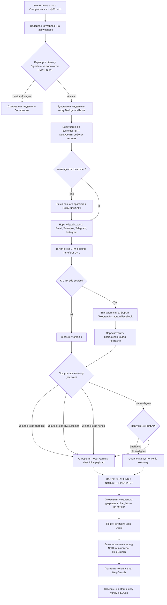

# Інтеграційний міст NetHunt - HelpCrunch Bridge: Рефакторинг та Логіка роботи

Цей документ містить детальний опис технічної логіки роботи інтеграційного сервісу та покроковий план рефакторингу для виправлення виявлених помилок і підвищення стабільності.

---

## 🛠️ План рефакторингу та виправлення помилок

Під час аналізу кодової бази та логів бази даних було виявлено критичні вразливості та баги, які потребують виправлення.

### 1. Виправлення багу створення контакту NetHunt (Синхронізація ID)
* **Проблема:** Під час створення нового контакту за допомогою методу `create_contact` у файлі `nethunt.py` NetHunt API повертає словник, де ідентифікатор запису зберігається в полі `"recordId"`. Проте основний код у `main.py` намагається отримати його через `.get("id")`. Через це згенерований ID стає `None`, що призводить до:
  * Помилок у пошуку пов'язаних угод (Deals).
  * Неправильного формування посилань на картки контактів у нотатках HelpCrunch.
  * Неможливості записати посилання на чат HelpCrunch назад у NetHunt CRM.
* **Рішення:** Модифікувати функцію `create_contact` в `nethunt.py`, щоб вона автоматично копіювала значення з `"recordId"` у `"id"` для консистентності з іншими методами пошуку. Додатково у `main.py` зробити безпечне зчитування імені контакту через `contact.get("name") or contact.get("fields", {}).get("Name")`.
* **Статус:** ✅ Виправлено (нормалізація `recordId` → `id` вже присутня в `create_contact` та `_normalize_records_response`).

### 2. Забезпечення стійкості сесій користувачів (Persistent Session Secret)
* **Проблема:** Зараз змінна `SESSION_SECRET` у `auth.py` генерується випадковим чином у пам'яті під час кожного старту додатка (`os.urandom(32)`). Це призводить до того, що під час будь-якого перезапуску Docker-контейнера чи автоматичного перезапуску сервера (reload) всі активні сесії адміністраторів анулюються, і користувачі змушені авторизуватися наново (разом із введенням TOTP 2FA коду).
* **Рішення:** Зберігати `SESSION_SECRET` у окремій таблиці бази даних SQLite (`session_keys`). Під час старту сервіс намагатиметься прочитати секрет із бази даних, а якщо його немає — згенерує, збереже в базу і використовуватиме надалі.
* **Статус:** ✅ Виправлено (`init_session_secret()` в `auth.py` зберігає секрет в таблиці `session_keys`).

### 3. Виправлення extraction `chat_id` з вебхуків HelpCrunch (КРИТИЧНИЙ БАГ)
* **Проблема:** Згідно з [документацією HelpCrunch](https://docs.helpcrunch.com/en/webhooks/message-webhooks), `eventData` містить поле `chat_id` (integer) безпосередньо, а не вкладене в об'єкт `chat` або `id`. Код використовував `event_data.get("id")` для `chat.new` та `event_data.get("chat", {}).get("id")` для `message.chat.customer`, що завжди повертало `None` для реальних вебхуків.
* **Наслідок:** `chat_id` = `None` → chat link ніколи не записується в NetHunt → локальне дзеркало ніколи не отримує `chat_link` → наступні вебхуки не можуть знайти існуючий контакт → створюється **новий лід** при кожному повідомленні (зациклення).
* **Рішення:** Використовувати `event_data.get("chat_id")` з fallback на `event_data.get("id")` для `chat.new`.
* **Статус:** ✅ Виправлено в `main.py` webhook handler.

### 4. Пріоритетний запис посилання на чат (Chat Link FIRST)
* **Проблема:** Запис chat link в NetHunt відбувався в кінці `_process_sync_task`, після пошуку угод та оновлення нотаток HelpCrunch. Якщо будь-яний з цих викликів падав по таймауту — chat link ніколи не записувався.
* **Рішення:** Перемістити запис chat link **одразу** після створення/знаходження контакту (STEP 4), до deals/notes/bilateral sync. Для нових контактів chat link пишеться прямо в payload створення. Для існуючих — окремим API викликом одразу після матчингу.
* **Статус:** ✅ Виправлено.

### 5. Негайне оновлення локального дзеркала
* **Проблема:** Оновлення локального дзеркала з `chat_link` відбувалося в самому кінці обробки. Якщо обробка переривалася — дзеркало не оновлювалось, і наступні вебхуки не могли знайти контакт по `chat_link`.
* **Рішення:** Оновлення локального дзеркала тепер виконується **одразу** після запису chat link в NetHunt (STEP 5).
* **Статус:** ✅ Виправлено.

### 6. Fetch повного профілю клієнта для message events
* **Проблема:** Вебхук `message.chat.customer` містить лише базові дані (id, name, email). Відсутні customData (Telegram, Instagram), phone, referer, source.
* **Рішення:** При подіях `message.chat.customer` робити API запит `get_customer` до HelpCrunch для отримання повного профілю з customData, referer, source.
* **Статус:** ✅ Виправлено.

### 7. Покращене витягнення UTM та джерел
* **Проблема:** Не було fallback на "organic" для прямих заходів. Не визначався medium для Telegram/Instagram з source/referer.
* **Рішення:**
  * Якщо немає source, referer, UTM та gclid → `utm_medium = "organic"`.
  * Якщо detected_platform = Telegram → `utm_medium = "Telegram"`.
  * Якщо detected_platform = Instagram → `utm_medium = "Instagram"`.
  * Якщо detected_platform = Facebook → `utm_medium = "Facebook"`.
  * gclid завжди записується в окреме поле NetHunt.
* **Статус:** ✅ Виправлено.

### 8. Блокування конкурентних вебхуків (Concurrency Lock)
* **Проблема:** FastAPI `BackgroundTasks` може обробляти кілька вебхуків для одного клієнта одночасно. Немає блокування — два вебхуки одночасно створюють два контакти.
* **Рішення:** Додано in-memory `asyncio.Lock` по `customer_id` в `process_sync_task`. Webhooks для одного клієнта обробляються послідовно.
* **Статус:** ✅ Виправлено.

### 9. Надійне логування помилок у фонових завданнях (Robust Error Handling)
* **Проблема:** У разі виникнення винятків у `_process_sync_task`, помилка не записувалася в SQLite з детальним трейсбеком.
* **Рішення:** `process_sync_task` обгорнутий в `try...except Exception` з записом деталізованого трейсбеку в SQLite з `status="error"`.
* **Статус:** ✅ Виправлено.

---

## ⚙️ Логіка роботи сервісу (NetHunt - HelpCrunch Bridge)

Міст забезпечує автоматичний обмін даними між HelpCrunch (чат-платформа) та NetHunt (CRM-система).

### Покроковий життєвий цикл обробки подій

### Детальний опис етапів роботи:

#### 1. Отримання та верифікація вебхуку
* HelpCrunch надсилає JSON-трансляцію подій на endpoint `/api/webhook`.
* Якщо задано секретний ключ вебхуку (`helpcrunch_webhook_secret`), сервіс розраховує SHA1 хеш на основі отриманого тіла (raw body) та порівнює його з заголовком `X-HelpCrunch-Signature`. У разі неспівпадіння запит відхиляється з кодом `401 Unauthorized`.
* Підтримуються такі події:
  * `chat.new` — ініціалізація нового чату. `chat_id` береться з `eventData.chat_id`.
  * `customer.new` — реєстрація нового клієнта.
  * `message.chat.customer` — нове повідомлення від клієнта. `chat_id` береться з `eventData.chat_id`.

#### 2. Блокування по customer_id
* Кожен вебхук отримує унікальний `asyncio.Lock` по `customer_id`, щоб уникнути конкурентного створення дублікатів. Якщо два вебхуки для одного клієнта приходять одночасно, другий чекає завершення першого.

#### 3. Fetch повного профілю для message events
* Для подій `message.chat.customer` робиться API запит `GET /v1/customers/{id}` до HelpCrunch, оскільки вебхук повідомлень містить лише базові дані (id, name, email). Повний профіль містить customData (Telegram, Instagram), phone, referer, source, location.

#### 4. Збір та очищення контактних даних
* Сервіс збирає телефон, пошту та месенджери клієнта.
* Номери телефонів автоматично проходять нормалізацію (регулярними виразами видаляються зайві пробіли, дужки, дефіси та додається префікс країни `+380` для України, якщо номер введений у локальному форматі).
* Якщо подія містить текст повідомлення клієнта, здійснюється сканування на наявність посилань на Telegram (`t.me/...`), Instagram (`instagram.com/...`), нікнеймів месенджерів (`@username`) або email-адрес. Знайдені дані інтегруються у загальний профіль клієнта.
* Telegram handle витягується з: customData, source URL (t.me/handle), referer URL.
* Instagram handle витягується з: customData, source URL (instagram.com/handle), referer URL.

#### 5. Визначення джерел залучення (UTM & Referer)
* Сервіс аналізує посилання джерела (`source` URL) та перенаправлення (`referer` URL) клієнта.
* Здійснюється парсинг URL для виділення UTM-міток (`utm_source`, `utm_medium`, `utm_campaign`, `utm_term`, `utm_content`) та ідентифікатора кліків Google Ads (`gclid`).
* Пріоритет UTM: customData → source URL params → referer URL params.
* На основі хоста реферера визначається платформа залучення (Telegram, Instagram, Facebook, Google, Viber, WhatsApp).
* Якщо платформа визначена і `utm_medium` не заданий — встановлюється відповідно (Telegram, Instagram, Facebook).
* **Organic fallback:** Якщо немає source, referer, UTM та gclid → `utm_medium = "organic"`.
* `gclid` завжди записується в окреме поле NetHunt.

#### 6. Пошук контакту (3 рівні)
**Рівень 1 — Локальне дзеркало (SQLite):**
1. Match by `chat_link` (найвищий пріоритет) — якщо chat_id відомий.
2. Match by `hc_customer_id` через `match_links` таблицю.
3. Match by полями (phone, email, telegram, instagram).

**Рівень 2 — NetHunt API:**
1. Search by HelpCrunch ID (точний пошук по полю).
2. Search by Email, Phone, Telegram (за пріоритетом з налаштувань).

**Рівень 3 — Створення:**
* Якщо не знайдено — створюється нова картка контакту з усіма зібраними полями + chat link в payload.

#### 7. Пріоритетний запис посилання на чат (Chat Link FIRST)
* **Для нових контактів:** Chat link пишеться прямо в payload створення запису — це перше, що потрапляє в NetHunt.
* **Для існуючих контактів:** Chat link оновлюється окремим API викликом `update_contact_chat_link` **одразу** після матчингу, ДО пошуку угод та нотаток.
* Якщо chat link вже актуальний — API виклик не робиться (оптимізація).

#### 8. Негайне оновлення локального дзеркала
* Одразу після запису chat link в NetHunt оновлюється локальне дзеркало:
  * Зберігається HC customer з нормалізованими полями.
  * Зберігається HC chat з chat_link.
  * Зберігається NH contact з chat_link та hc_customer_id.
  * Створюється match_link (hc_customer_id ↔ nh_contact_id, confidence=high).
* Це гарантує, що наступні вебхуки для того ж чату знайдуть контакт миттєво через локальне дзеркало.

#### 9. Двостороння синхронізація (Bilateral Sync)
* **HelpCrunch ← NetHunt:** Оновлюється профіль клієнта в HelpCrunch з нововитягнутими даними (email, phone, telegram), яких раніше не було.
* **HelpCrunch ← NetHunt (нотатки):** Записується посилання на лід NetHunt + інформація про угоди в нотатки клієнта та приватну нотатку в чат.

#### 10. Робота з угодами (Deals) та нотатки
* Сервіс робить запит до папки угод у NetHunt CRM, щоб знайти відкриті угоди, пов'язані з ідентифікатором контакту.
* Усі знайдені угоди (назва, статус/етап, сума та пряме посилання на CRM) форматуються в один звіт.
* Отриманий звіт записується безпосередньо в поле загальних нотаток (Notes) клієнта в HelpCrunch.
* Також цей звіт відправляється у вигляді приватного повідомлення (Private Note) безпосередньо в поточний робочий чат HelpCrunch. Оператор підтримки бачить статус угод клієнта прямо під час діалогу, не переходячи до CRM-системи.
